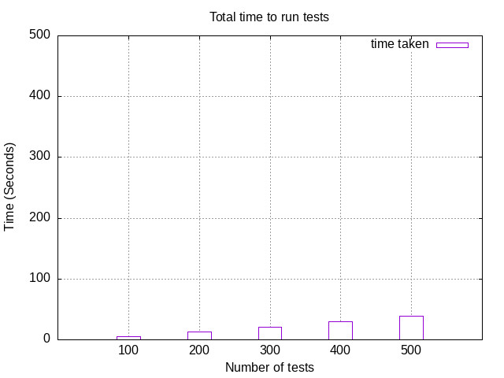
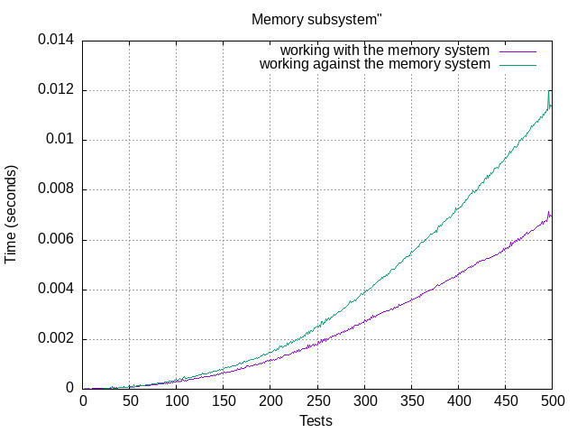
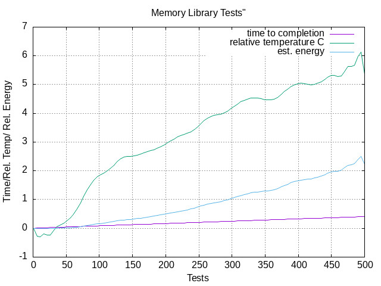

# Benchmarking the RPI 4B #

The provided scripts in the benchmarking folder in this repository will give you a taste of understanding the throughput and power consumption for the RPI that we setup.

Steps to run the tool

1. Copy the folder to RPi

    We can copy the folder into the RPi using various command line tools. One of them is the `scp` command:

    `scp -r ../benchmarking starry.local:~/Desktop/benchmarking`

2. Run the tool

    Using the terminal, navigate into the benchmarking folder and run the `run.sh` script to start the testing. Close all other apps inside the rpi to make sure that the RPi is not running any other heavy processes.

3. Generate plots

   When complete, the test will generate three plots as shown below:
   

   

   
