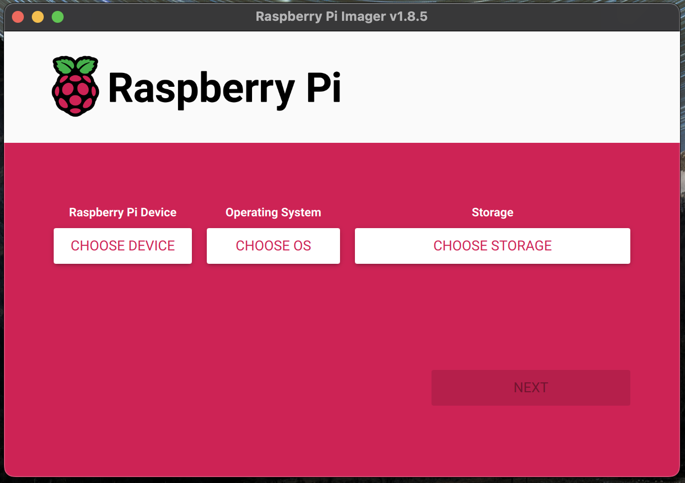
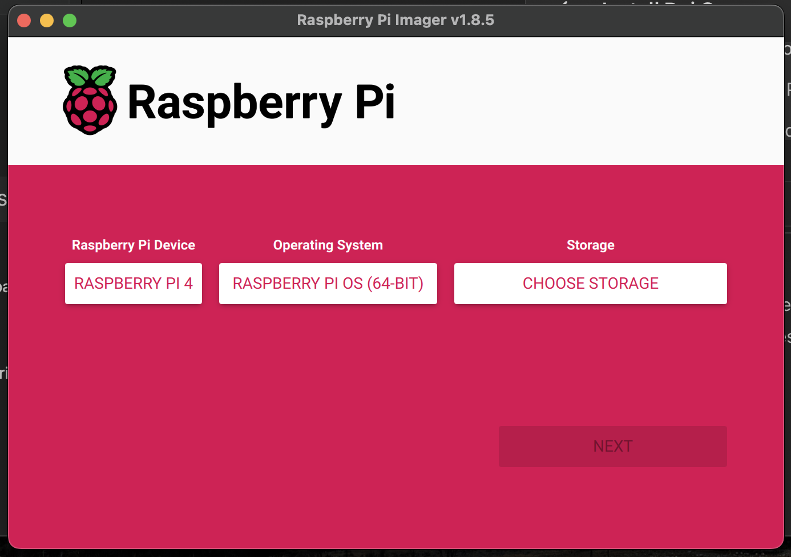
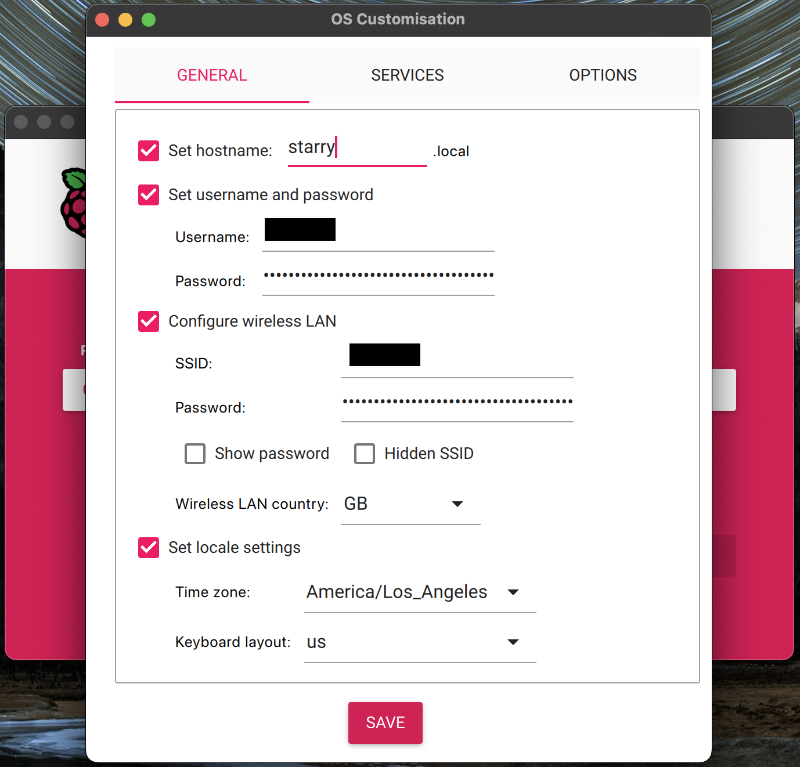
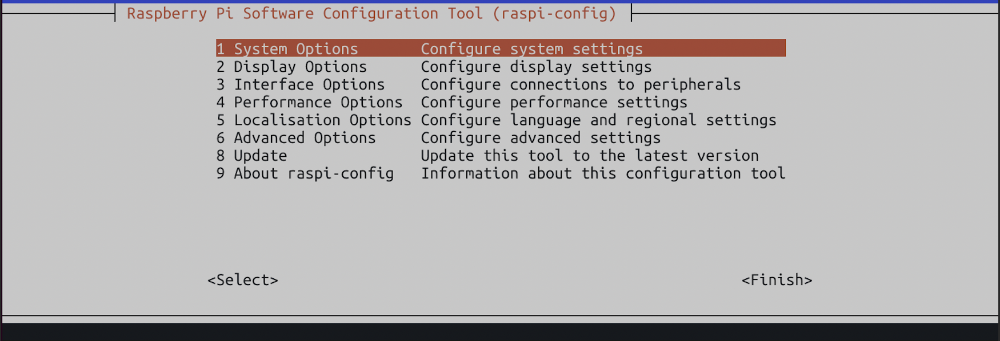
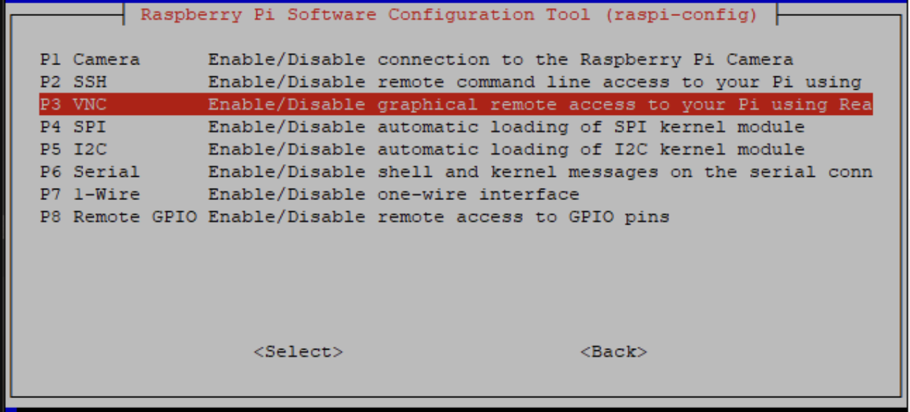
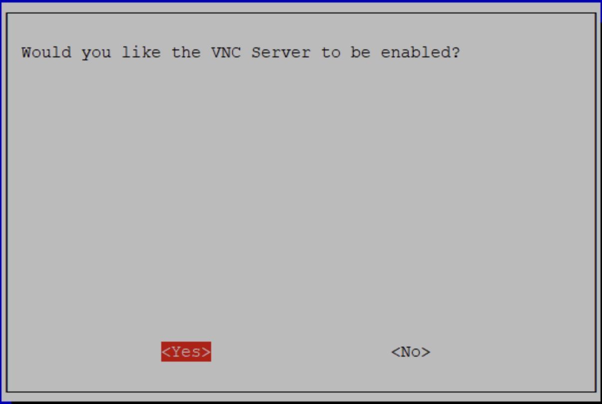

# Install Raspberry Pi OS #

The Raspberry Pi boots from a microSD card. Follow these steps to install Raspberry Pi OS (formerly called Raspbian) on your microSD card:

Steps to Install Raspberry Pi OS

1. Prepare the microSD Card and the Imager

    Connect the microSD card to your computer. Download the Raspberry Pi Imager and launch it.

    
2. Choose Device as RPI 4B and OS as the recommended 64-bit raspbian OS (Bookworm in this case)

    

3. Choose Storage

    Click CHOOSE STORAGE, and select the microSD card you intend to use in your Raspberry Pi.

    

4. Configure Raspberry Pi for Remote Access

    Click Next, and when prompted, select EDIT SETTINGS. And add necessary details in this menu like the username, password, hostname, and enable SSH. Also provide the wifi credentials if you are planning to connect using the wifi on bootup.

    

    **Important: Remember the hostname, username, and password for SSH access.**

5. Finalizing the Installation

    Double-check your OS and Storage settings, then click YES.
    Confirm erasing your microSD card by selecting YES. You may be prompted by your operating system to enter an administrator password.
    The Imager will begin writing and verifying the Linux installation to the microSD card.

6. Booting the Raspberry Pi

    Remove the microSD card from your computer once the installation is complete. Insert the SD card into your Raspberry Pi.

    Power on the Raspberry Pi by plugging in a c-type power adapter. A red LED will turn on, indicating that the Pi is connected to power. For the first boot-up, It might take about 3-4 minutes for the RPi to initialize and get connected to the wifi.

7. Software installation

    * SSH into your RPi using the hostname set during the setup process (starry.local in our case)
    * Run `sudo apt update & sudo apt upgrade` to install the latest versions of included apps and services.
    * Run `sudo raspi-config` and Configured VNC via > "Interfacing Options" > "VNC" > "Yes"
    
    
    
    * Now you can log into the raspberry Pi using its host id **starry.local** using a vnc client software like [realVNC](https://www.realvnc.com/en/connect/download/viewer/?lai_vid=53dJeVM4MtvA&lai_sr=5-9&lai_sl=l&lai_p=1)
